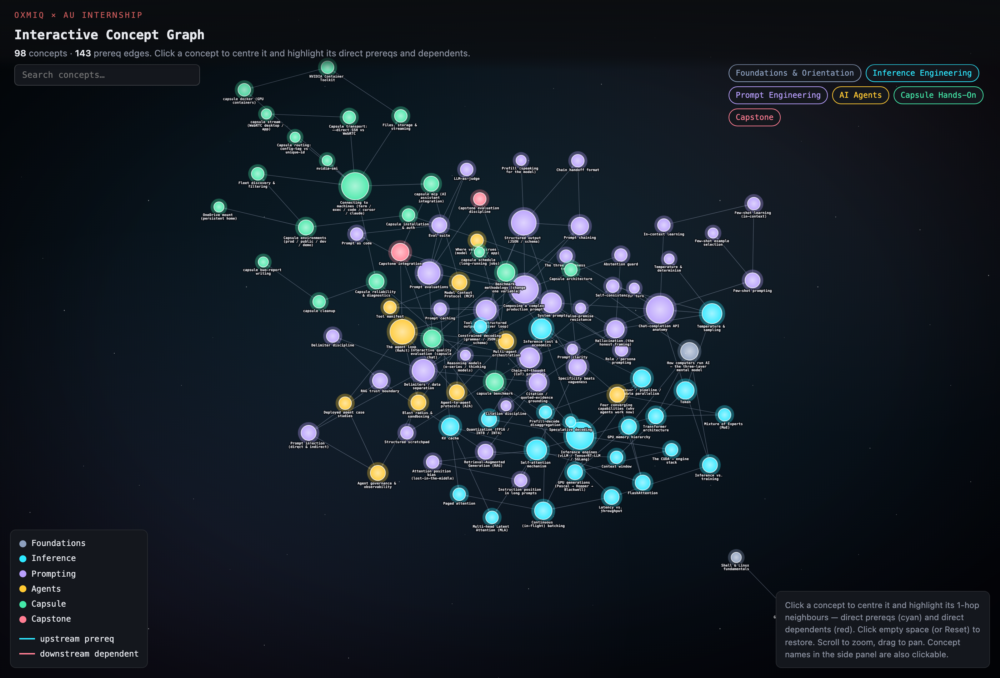
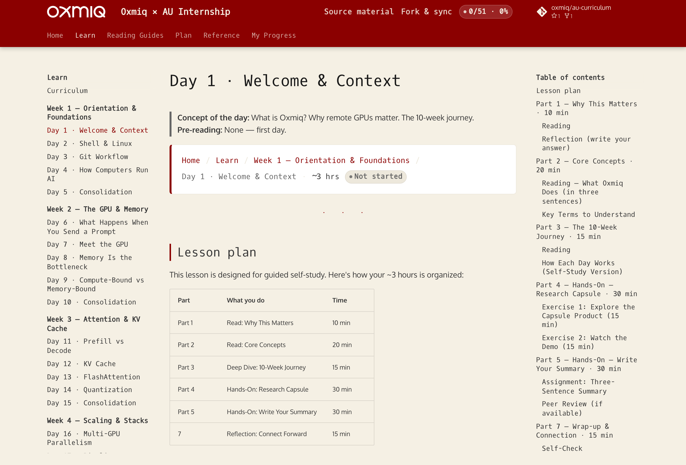
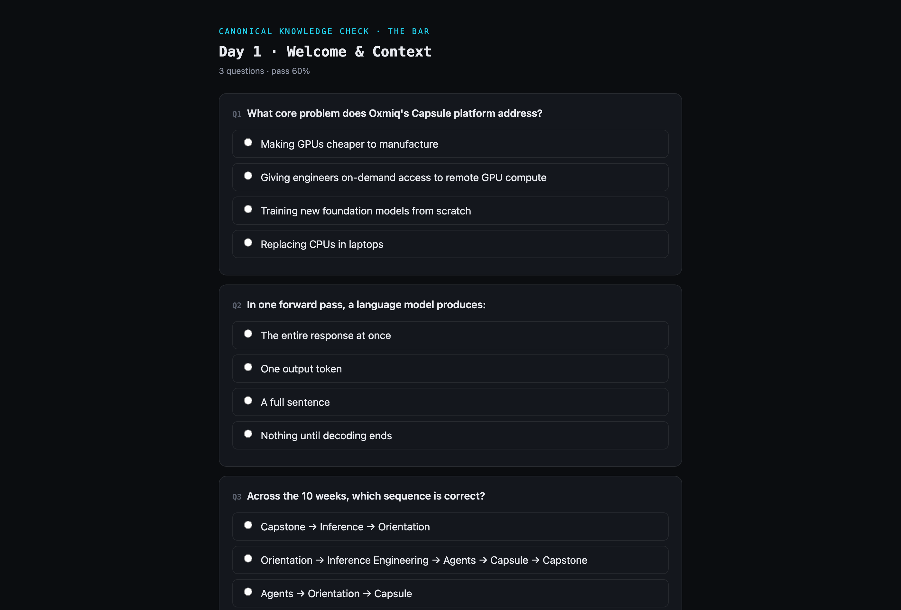

# Oxmiq × Andhra University — Internship Curriculum

Your personal learning environment for the 10-week program. You'll **fork** this repo, run the lesson site on your own machine, and (once enrolled) use **oxtutor** as your on-demand AI tutor.

> **New here?** Jump to [What is this?](#what-is-this) first, then [Prerequisites](#prerequisites) and [Quickstart](#quickstart). The oxtutor/Capsule tooling is **optional** and only needed after you're enrolled — you can complete every lesson and knowledge check without it.

---

## What is this?

This repository is the official curriculum for the **Oxmiq × Andhra University Internship Program** — a 10-week course on how modern AI actually runs in production.

- **What you learn:** inference engineering (GPUs, memory, attention, KV cache, quantization, scaling), prompt engineering, AI agents, and the Capsule platform — finishing with a hands-on capstone on real hardware.
- **How you learn:** structured daily lessons, a canonical knowledge check per lesson, an interactive curriculum map that tracks what you've passed and what unlocks next, and an AI tutor (oxtutor) that re-explains concepts and quizzes you.
- **Duration & cadence:** 10 weeks, half-days (~3 hours), one concept per day, Friday consolidation. 50 sessions across 5 phases.
- **Who it's for:** university interns — from motivated beginners to intermediate students. You should be comfortable using a terminal and willing to learn Git; no prior AI/ML or GPU experience is assumed.
- **By the end you can:** reason about how an LLM serves a request end-to-end, explain the memory and compute trade-offs behind inference performance, design a simple AI agent, operate the Capsule platform, and benchmark/evaluate a model on real GPUs.

See the full breakdown in **[Curriculum](docs/curriculum.md)**, the rationale in **[Why this curriculum](docs/rationale.md)**, and the day-by-day map in **[Roadmap](docs/roadmap.md)**.

### Curriculum at a glance

| Week | Phase | Focus |
|------|-------|-------|
| 1 | Foundations | Orientation, shell & Linux, Git workflow, how computers run AI |
| 2 | Inference Eng. | The GPU & memory — why memory is the bottleneck |
| 3 | Inference Eng. | Attention & KV cache, FlashAttention, quantization |
| 4 | Inference Eng. | Multi-GPU parallelism, MoE, speculative decoding, vLLM |
| 5 | Inference Eng. | Latency vs throughput, production deployment, eval, economics |
| 6 | Agents | Prompt engineering, agent fundamentals, tools, governance |
| 7 | Bridge | Agent case studies → Capsule foundations & installation |
| 8 | Capsule | Connecting, files & storage, streaming, known quirks |
| 9 | Capsule | Benchmarking, model evaluation, interactive chat, scheduling & MCP |
| 10 | Capstone | Plan → execute → analyze → present a real-hardware project |

---

## Prerequisites

Install these before you start. Version numbers are the minimum tested.

| Tool | Version | Notes |
|------|---------|-------|
| **Git** | any recent | To fork, clone, and pull new lessons. |
| **Python** | **3.10+** | Runs the local lesson site (MkDocs). Check with `python3 --version` (macOS/Linux) or `py --version` (Windows). |
| **pip** | ships with Python | If `pip` isn't found, use `python3 -m pip …` (see [Troubleshooting](#troubleshooting)). |
| **A web browser** | any | The lesson site opens at `http://localhost:8000`. |
| VS Code | optional | Any editor works; VS Code is what most of the cohort uses. |

> The **oxtutor** AI tutor also needs the **Capsule CLI**, which is provisioned when you're enrolled — see [oxtutor & Capsule](#oxtutor--capsule-optional--requires-enrollment). It is **not** required to run the lessons.

---

## Quickstart

> **Which `python` command?** On macOS/Linux use `python3` and `pip3` (or `python3 -m pip`). On Windows use `py`. If a bare `pip` or `mkdocs` command reports "not found", prefix it with `python3 -m` / `py -m` — see [Troubleshooting](#troubleshooting).

```bash
# 1. Fork this repo on GitHub (Fork button), then clone YOUR fork
git clone https://github.com/<your-username>/au-curriculum.git
cd au-curriculum

# 2. Add the upstream remote so you can pull new lessons later
git remote add upstream https://github.com/oxmiq/au-curriculum.git
git remote -v                       # confirm: origin = your fork, upstream = oxmiq

# 3. Create a virtual environment and install the site tooling
python3 -m venv .venv
source .venv/bin/activate            # Windows: .venv\Scripts\activate
python3 -m pip install -r requirements.txt

# 4. Run the site locally
mkdocs serve                         # then open http://localhost:8000
#   if "mkdocs" is not found:  python3 -m mkdocs serve

# 5. Stay current with new lessons (safe — you only ever write to your own folders)
git pull upstream main
```

Open the **Curriculum Map** in the site to see every concept, what you've passed, and what unlocks next. Click a concept to read its lesson, then take the knowledge check at the bottom.

> **Full fork/sync details** — including how pulls stay conflict-free — are in **[FORKING.md](FORKING.md)**. Other ways to view the material (no-server demos, the instructor dashboard) are in **[ACCESS.md](ACCESS.md)**.

---

## Screenshots

| Curriculum map | Lesson page | Knowledge check |
|----------------|-------------|-----------------|
| [](docs/assets/screenshots/curriculum-map.png) | [](docs/assets/screenshots/lesson.png) | [](docs/assets/screenshots/knowledge-check.png) |

_An oxtutor session screenshot will be added once student provisioning is live (it needs an enrolled Capsule login)._

---

## How it fits together

```
 You (student)
     │  fork + clone, run mkdocs serve
     ▼
 Local lesson site  ─────────►  Curriculum map · lessons · knowledge checks
 (MkDocs, in your fork)              (read-only, synced from upstream via git pull)
     │
     │  optional, after enrollment
     ▼
 Capsule CLI  ──►  oxtutor agent  ──►  Model endpoint (Oxmiq-hosted)
     │                  │
     │                  ▼
     │            re-explains lessons, quizzes you, records progress
     ▼
 Your progress files (docs/practice/, docs/progress/, scratch/)
     └──►  committed to your fork; the instructor cohort view reads them back
```

The lessons and site are fully self-contained. **oxtutor is a layer on top** — it reads your lesson files to ground its teaching and writes only to your own folders, so `git pull` never conflicts.

---

## oxtutor & Capsule (optional — requires enrollment)

**Capsule** is Oxmiq's remote-development and agent platform: it lets you run tools and agents on Oxmiq-managed hardware from your laptop. **oxtutor** is a Capsule agent — your AI tutor for this course. It re-explains lessons, generates practice knowledge checks, and records your progress, writing only to `docs/practice/`, `docs/progress/`, and `scratch/`. See [`agents.md`](agents.md) for how it navigates this repo.

> ### ⚠️ Enrollment required
> The `capsule` CLI, your Capsule login, and your model endpoint/key are **provisioned when you're enrolled in the cohort** (at kickoff). Until then, `capsule …` commands will report `command not found` — this is expected. **You do not need oxtutor to work through the lessons or take the knowledge checks;** it's a study aid, not a prerequisite. Install it once you have access.

Once you're enrolled and have access:

1. **Install the Capsule CLI** — follow the OS-specific steps in the **[Capsule Lab Guide → Module 2 (Installation & First Login)](docs/readings/capsule/lab-guide.md)**. (Installation uses an org GitHub token issued to enrolled students; the release tap is private by design.)
2. **Sign in:**
   ```bash
   capsule auth login
   ```
3. **Run oxtutor** — the first run installs the oxtutor runtime automatically:
   ```bash
   cd au-curriculum
   capsule agent oxtutor -p "explain TTFT"
   ```

### Connecting oxtutor to a model

oxtutor is a thin client: it needs a model **endpoint**, a **model name**, and a **key**, and fails fast if any is missing. Oxmiq gives you these values during onboarding. Provide them as environment variables (or CLI flags — a flag overrides its variable):

| What | Environment variable | CLI flag |
|------|----------------------|----------|
| Endpoint | `OXMIQ_AGENT_API_BASE` | `--api-base` |
| Model | `OXMIQ_AGENT_MODEL` | `--model` |
| Key | `OXMIQ_AGENT_API_KEY` | `--api-key` |

```bash
export OXMIQ_AGENT_API_BASE="<endpoint-from-onboarding>"
export OXMIQ_AGENT_MODEL="<model-from-onboarding>"
export OXMIQ_AGENT_API_KEY="<your-key-from-onboarding>"

capsule agent oxtutor -p "quiz me on this week's lesson"
```

To force an update to the latest runtime: `capsule agent oxtutor update`.

> **Coming soon — automatic setup.** Once student provisioning is live, `capsule auth login` will wire your endpoint, model, and personal key for you and you won't set any of these by hand. Until then, use the explicit values from onboarding.

### Data & privacy

oxtutor writes progress and practice files **into your own fork** (`docs/progress/`, `docs/practice/`, `scratch/`) — you control that repo. It sends your prompts and the relevant lesson text to the Oxmiq-hosted model endpoint to generate responses. It does not modify lesson content and does not push on your behalf; you commit and push your progress yourself.

---

## FAQ

**Do I need to install Capsule/oxtutor before starting the lessons?**
No. The lessons and knowledge checks run entirely from the local site (`mkdocs serve`). oxtutor is an optional study aid you add after enrollment.

**Should I set up oxtutor before attempting the quizzes?**
Not required. The knowledge checks are self-contained in the site. oxtutor can *generate extra practice* and re-explain concepts, but the canonical checks don't depend on it.

**I'm not enrolled yet — how much can I do?**
Everything except oxtutor: fork, run the site, read all lessons, take all knowledge checks, and explore the curriculum map.

**Where are the Capsule install instructions?**
In the [Capsule Lab Guide, Module 2](docs/readings/capsule/lab-guide.md). They require an enrolled student's GitHub token.

---

## Troubleshooting

| Symptom | Fix |
|---------|-----|
| `pip: command not found` / `zsh: command not found: pip` | Use `python3 -m pip install …` (macOS/Linux) or `py -m pip install …` (Windows). |
| `mkdocs: command not found` / not recognized (Windows) | Use `python3 -m mkdocs serve` / `py -m mkdocs serve`. This happens when Python's Scripts dir isn't on your PATH; activating the virtualenv (step 3) also fixes it. |
| `git pull upstream main` → `'upstream' does not appear to be a git repository` | You skipped step 2. Run `git remote add upstream https://github.com/oxmiq/au-curriculum.git`. |
| `mkdocs serve` prints `INFO` notes about `planning/source-material/...` links | **Expected.** Those citations point to files outside the site and resolve on GitHub, not the local site. They're informational, not errors — the site still builds and serves. |
| Repeated `WARNING "GET /ws/..." code 404` in the serve log | Harmless — that's the live-reload websocket reconnecting. The site works fine. |
| `capsule: command not found` | Capsule is provisioned at enrollment — see [oxtutor & Capsule](#oxtutor--capsule-optional--requires-enrollment). Not needed for lessons. |

---

## Layout

- `docs/lessons/` — the lessons + canonical knowledge checks (read-only; synced from upstream)
- `docs/kb/` — the curriculum map, dependency graph, glossary, and concept views
- `docs/curriculum.md`, `docs/rationale.md`, `docs/roadmap.md` — the shape and the why
- `docs/readings/` — pre-lecture reading guides (prompt engineering, AI agents, Capsule)
- `docs/practice/`, `docs/progress/`, `scratch/` — **yours**; oxtutor writes here
- `agents.md`, `skills/` — how oxtutor is configured
- `mkdocs.yml`, `overrides/`, `hooks/` — site config and build-time hooks

---

## Contributing & license

External contributions (typo fixes, broken-link reports, clarifying edits) are welcome — see **[CONTRIBUTING.md](CONTRIBUTING.md)** for the branch/PR workflow and how to author lessons. This project is licensed under the **[MIT License](LICENSE)**.
